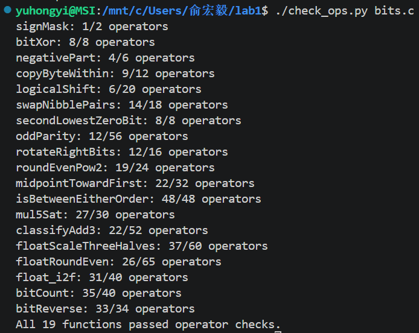
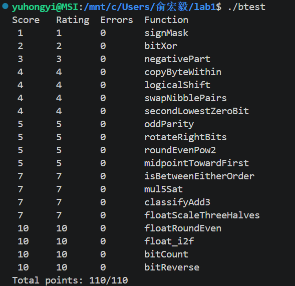

Lab1实验报告

· 实验标题：lab1
· 姓名：俞弘毅
· 学号：25803060014

一、终端执行截图

· ./check_ops.py bits.c:

· ./btest:

二、各函数实现思路

P1 signMask

将 1 左移 31 位，得到最高有效位为 1 的掩码 0x80000000。

P2 bitXor

x^y=(x&~y)+(~x&y),但由于不能用+，由摩根定律变成~( ~(x&~y)&~(~x&y))。

P3 negativePart

通过 x >> 31 得到符号掩码。若 x 为负数，掩码全 1；用 ~x + 1 计算相反数，再与掩码相与。若x为正数，掩码为 0，结果为 0。

P4 copyByteWithin

1. 先把字节数*8变成比特数，用srcShift和dstShift储存位移量。
2. 将x左移srcShift位，并&0xFF保留“src编号的字节”。
3. mask左移dstShift位取反，并&x删去“dst编号字节”。4.把“src编号的字节”左移dstShift位完成复制。

P5 logicalShift

1. 先把x算数右移。
2. 构造mask掩码，形式为000000111......。
3. “mask&x”把x为负数时算数右移多出的1删去。

P6 swapNibblePairs

1. 由于长度限制，构造mask0F和maskF0。
2. 把两个分别与自己左移的值合并并重复操作，构造 0x0F 和 0xF0 的重复掩码。
3. 分别提取每个字节的低 4 位和高 4 位，将低 4 位左移 4 位、高 4 位右移 4 位，最后合并。

P7 secondLowestZeroBit

1. 先把x取反为y，此时即找到第二个最低位的1。
2. z = y & (~y + 1)找到第一个最低位的1。
3. rest=y^z消除第一个最低位的1。4.重复操作找到第二个最低位的1。

P8 oddParity

通过不断折半异或，将 32 位中 1 的个数压缩到最低位，最后判断最低位是否为 0。若为 0，说明 1 的个数为偶数，返回 1。

P9 rotateRightBits

1. n&31防止超出限制。
2. (x >> s)左移n位，再用~((1 << 31) >> s << 1)避免x为负数时带来的1，提取右半部分。
3. ((33 + ~s) & 31)构造32-s，然后把x左移提取左半部分。3.合并。

P10 roundEvenPow2

1. 构造half=2^(n-1)，mask=2^n-1；从而提取商q和余数r。
2. cond检验余数是否是一半，是→1；even检验商是否为偶数，是→1。
3. ((x + half) >> n)提取最近的倍数，在满足“正好落在两个倍数正中间”时结果为q+1；而(~(cond & even) + 1)检验是否“余数为一半且q为偶数”，是则把结果还原为q。
4. “<< n”输出q*2^n。

P11 midpointTowardFirst

1. avg储存(x+y)/2；x+y为奇数时，odd为1。
2. 判断x>y且要避免溢出：（1）diff=x-y（2）sx和sy用来判断x和y正负。（3）当x,y异号且x>0时((sx ^ sy) & ~sx)=1；当x,y同号且diff>0时(same & ~(diff >> 31))=1；两者合并判断x>y。
3. 假如x>y且x+y为奇数则avg+1。

P12 isBetweenEitherOrder

仿照P11，geA,leA,geB,leB分别代表x>=a,x<=a,x>=b,x<=b；然后判断是否在[a,b]内。

P13 mul5Sat 

1. sign提取符号位，abs_x得到x的绝对值。
2. 先判断x*4是否溢出，再判断x*5：“((x4 ^ x5) & (x ^ x5)) >> 31”如果 x4 和 x 同号，相加结果 x5 却与它们异号，说明发生了溢出。溢出时 ovf_add 为 -1，否则为 0。然后合并溢出标志，溢出则ovf=1。
3. “(sign & (1 << 31)) | (~sign & ~(1 << 31))”依据符号位构造饱和值。若为负数（sign 全 1），得到 INT_MIN (0x80000000)；若为正数（sign 为 0），得到 INT_MAX (0x7fffffff)。
4. “mask = (ovf << 31) >> 31”将溢出标志转化为全 1（溢出）或全 0（未溢出）的掩码。
5. 最后合并结果。

P14 classifyAdd3 搞完

仿照P13，分步计算 x+y 和 (x+y)+z，分别检测每次加法是否溢出，并记录溢出方向。若两次溢出方向相反则抵消，否则返回对应的溢出方向。

P15 floatScaleThreeHalves

1. 从 uf 中分离出符号位 sign（1位）、阶码 exp（8位）和尾数 frac（23位）。
2. 处理特殊值：exp == 0xFF，说明是 NaN 或无穷大，返回原值 uf；exp == 0 && frac == 0，说明是 +0 或 -0，乘以 1.5 仍是原值，也直接返回 uf。
3. 非规格化数：非规格化数的真实值为 0.frac * 2^(-126)。q = frac * 3，然后除以 2（q >>=1），并利用 rem 和 q & 1 进行就近舍入到偶数。随后判断 q & 0x800000：
   · 若为 1，说明尾数进位了，变成了规格化数，此时阶码变为 1（1 << 23），返回拼接后的位模式。
   · 若为 0，说明仍是非规格化数，阶码仍为 0，直接返回 sign << 31 | q。
4. 处理规格化数：规格化数的真实值为 1.frac * 2^E。先提取 24 位尾数 M = 0x800000 | frac，然后计算 P = M + (M << 1)，等价于 M * 3。由于 M 是 24 位，P 的结果可能是 24 位或 25 位。
5. 确定舍入位数并进行舍入：k = (P & (1U << 25)) ? 25 : 24; 判断乘积占了多少位。drop = k - 23; 计算需要丢弃的低位数量。keep = P >> drop; 保留高 23 位作为新尾数；rem = P & ((1U << drop) - 1); 提取被丢弃的余数部分。half = 1U << (drop - 1); 作为“正中间”的阈值。随后用 if (rem > half || (rem == half && (keep & 1))) 执行就近舍入到偶数。如果进位导致 keep 的第 24 位变成 1（keep & (1U << 24)），则需要右移 1 位并将 k 增加 1。
6. 计算新阶码并处理溢出：newexp = exp + k - 24; 由于 M 是 24 位，P 变成了 k 位，相当于指数增加了 k - 24。如果 newexp >= 0xFF，说明阶码溢出，返回正负无穷大（0x7F800000）。
7. 拼接结果：最后将符号位、新阶码和尾数（keep & 0x7FFFFF）按位或，组装成最终的 32 位浮点数位模式并返回。

P16 floatRoundEven

1. 提取结构信息：提取符号位 sign、阶码 exp 和尾数 frac。
2. 处理特殊值（NaN、Inf、非规格化数）：若 exp == 0xFF，直接返回 uf；若 exp == 0（非规格化数），说明数值极小，直接舍入为 0 并保留输入符号（sign << 31）。
3. 计算真实指数 E：int E = exp + ~127 + 1;（等价于 exp - 127，禁用减法）。若 E < -1，说明绝对值小于 0.5，直接返回带符号的 0；若 E >= 23，说明已经是整数（或精度不足表示小数），直接返回 uf。
4. 处理需要舍入的情况（-1 <= E < 23）：提取完整的 24 位尾数 M = 0x800000 | frac。计算需要右移的位数 shift = 23 - E;，掩码 mask = (1U << shift) - 1;，余数 rem = M & mask;，保留部分 keep = M >> shift;。计算“正中间”的阈值 half = 1U << (shift - 1);。
5. 执行“就近舍入到偶数”：若 rem > half 或 rem == half && (keep & 1)（在正中间且保留部分为奇数），则 keep++。若 keep == 0，说明舍入后变为 0，返回带符号的 0。
6. 重新组装浮点数：将整数 keep 重新转为浮点数格式。通过 while(tmp > 1) 循环计算 keep 的最高位位置 k，新阶码 newexp = 127 + k，新尾数 newfrac = (keep << (23 - k)) & 0x7FFFFF。最后拼接符号、阶码和尾数。

P17 float_i2f

1. 处理 0 的情况：若 x == 0，直接返回 0。
2. 处理符号位与绝对值：若 x < 0，置符号位 sign = 1，并通过 absX = ~x + 1 计算绝对值（禁用减法）；否则 absX = x。
3. 计算阶码和最高位位置：初始化 exp = 127，通过 while(tmp > 1) 循环将 tmp 右移，每次循环 exp++ 且 shift++，最终 shift 记录了最高有效位的位置（即指数大小）。
4. 计算尾数：若 shift <= 23，直接将 absX 左移 (23 - shift) 位补齐尾数；若 shift > 23，说明尾数长度超过 23 位，需右移 shr = shift - 23 位。截断时提取 roundBit 和 leftover，执行“就近舍入到偶数”。
5. 处理舍入溢出：若舍入后 frac 的第 24 位变为 1（frac & (1U << 24)），说明尾数溢出，需将 frac 右移 1 位并让 exp 增加 1。最后将 frac 与 0x7FFFFF 相与保留低 23 位。
6. 拼接结果：返回 (sign << 31) | (exp << 23) | frac。

P18 bitCount

1. 构造掩码：由于整数题常量限制为 0~255，通过移位和按位或构造 m1 = 0x55555555（连续 2 个 1 位 1 个 0）、m2 = 0x33333333（连续 4 个 2 位 1 个 0）、m4 = 0x0F0F0F0F（连续 8 个 4 位 1 个 0）。
2. 分治统计 2 位一组：x = (x & m1) + ((x >> 1) & m1); 统计相邻 2 位的 1 的个数。
3. 分治统计 4 位一组：x = (x & m2) + ((x >> 2) & m2); 统计相邻 4 位的 1 的个数。
4. 分治统计 8 位一组：x = (x & m4) + ((x >> 4) & m4); 统计相邻 8 位的 1 的个数。
5. 累加与返回：x = x + (x >> 8); 累加相邻 16 位；x = x + (x >> 16); 累加高 16 位和低 16 位，此时 x 的低 6 位即为总 1 的个数。返回 x & 0x3F。

P19 bitReverse

1. 构造掩码：利用小常量（0x55, 0x33, 0x0F, 0xFF）通过左移和按位或操作构造出 m1、m2、m4、m8（0x00FF00FF）和 m16（0x0000FFFF）。
2. 交换相邻 1 位：x = ((x >> 1) & m1) | ((x & m1) << 1); 交换每 2 位内部的高低 1 位。
3. 交换相邻 2 位：x = ((x >> 2) & m2) | ((x & m2) << 2); 交换每 4 位内部的高低 2 位。
4. 交换相邻 4 位：x = ((x >> 4) & m4) | ((x & m4) << 4); 交换每个字节内部的高低 4 位。
5. 交换相邻 8 位：x = ((x >> 8) & m8) | ((x & m8) << 8); 交换每 16 位内部的高低 8 位。
6. 交换相邻 16 位：x = ((x >> 16) & m16) | ((x & m16) << 16); 交换高低 16 位。关键点：这里必须使用掩码 m16，否则有符号右移 >> 会进行算术右移，引入符号位导致结果错误（如 0x7ffffffe 错算为 0xfffffffe）。
7. 返回结果：此时 x 的位已经完全反转，直接返回 x。
